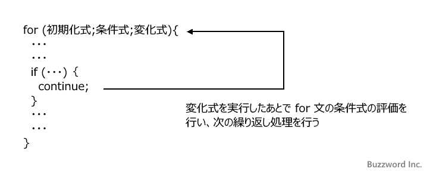

## tips
- ある値に対応する値がひとつに定まっているような場合には連想配列（辞書）を使うのが便利
***
## よく忘れるやつ
```js
//join()は配列を文字列にする
arry.join() 

//split()は文字列を配列にする
string.split(' ')
```
***
## ループの書き方
- 反復回数が決まっているときは`forループ`  
- 反復回数が決まっていないときは`whileループ`が良さげ  

```js
let n = 5;
let num = null;

let i = 0
while (true) {
  if (i === n) {
    num = i;
    break;
  }
  i++;
}
console.log(num); // 5
```
***
## DOMをクリアする
```js
while (data_wrapper.firstChild) {
  data_wrapper.removeChild(data_wrapper.firstChild);
  }
```
***
## `querySelector`より`getElemtntById`のが速い
なるべく限定的なセレクターゲットメソッドを使う
***
## HTMLコレクションはイテレートできない
下記の場合、HTMLコレクションは配列でないためイテレートできずエラーとなる
```js
const els = document.getElementsByClassName('hoge')
els.forEach(el => ...)
// HTMLコレクションが返ってくる(非配列)
```
スプレッド演算子を使う
```js
[...els].forEach(el => ...)
```
***
## continue文
```js
for () {
  if (条件) continue; 
  // 条件に合致する場合移行の処理をスキップして次の繰り返し処理に移る
  処理
}
```

***
## 出会ったなぞのバグ？
`split()`でクラスの帳尻をあわせたく、意味のないクラス名をつけることがありました。  
下記のように`split(' ')[3]`で`hoge`を取得したく`_`を２つ挿入。  
```
class = "foo _ _ hoge"
```
しかしなんやかんや処理を重ねるなか、ある瞬間から`_`が１つ消える現象に遭遇。  
文字にしても駄目。
```
class = "foo a a hoge"
```
こうするとOKでした。
```
class = "foo _ __ hoge"
```
なぞ。
***