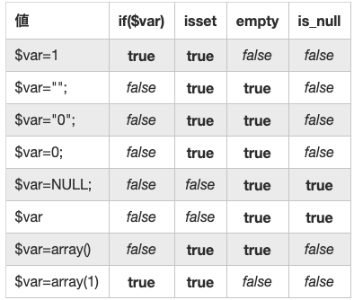

## webページへジャンプ
`header(' key : value ')`  
ヘッダーを送信する
```php
header('Location: https://sukeo-sukeo.github.io/FlagCollectionApp/index.html')
```
## 文字数を返す
length的なやつ
```php
strlen()
```
***
## 配列が空かどうかチェック
```php
if (empty(配列)) {
  空 true
} else {
  空じゃない false
}
```
issetとの違い  

### 例:エラーがない場合...
```php
if (empty($error)) {
		
	}
```
***